<h1 align="center">🤖 Withyou_bot</h1>
<h3 align="center">Анонимная поддержка, письма и общение — в трудный момент</h3>

<p align="center">
  
  
  
</p>

---

## 🧠 О боте

`Withyou_bot` — это анонимный Telegram-собеседник, созданный, чтобы быть рядом в сложные моменты.  
Он предлагает безопасное пространство для общения, эмоциональной поддержки и случайных добрых писем.

---

## 💡 Основные функции

| 🧩 Возможность            | 💬 Описание                                                                 |
|--------------------------|------------------------------------------------------------------------------|
| 🫂 Анонимный чат         | Общение один на один с незнакомцем — без регистрации, логов и ников         |
| ✉️ Письма                | Отправь письмо неизвестному и получи чужое — честное, случайное, живое      |
| 📍 Люди рядом            | Найди пользователей в своём городе или поблизости                          |
| 💌 Приглашение в ЛС      | Отправь запрос на переход в личку — собеседник может согласиться или отказать |
| 🎧 Музыка по состоянию   | Подборка треков и плейлистов под эмоции: пустота, тревога, паника, любовь  |
| 🧠 Эмоциональные кнопки  | Быстрые реакции — бот ответит и поддержит как человек, в стиле живого общения |


---

🗺️ Возможности для будущего
🔗 Web-версия для переписок

🔒 Режим "Под замком": письма, доступные после события

📈 Аналитика по гео и письмам (без сбора личных данных)

🧠 Подключение ChatGPT с персонализированной манерой ответа

---

## 🔒 Лицензия и права
Пока бот закрыт, но может быть опубликован под open-source лицензией.
Если хочешь внести вклад — пиши мне @danilgap в Telegram.

---

<h3>📽 Демонстрация бота</h3>
<p align="left">
  
</p>

---

## 📸 Скриншоты
<h3>🤖 О боте</h3>
<p align="left">
  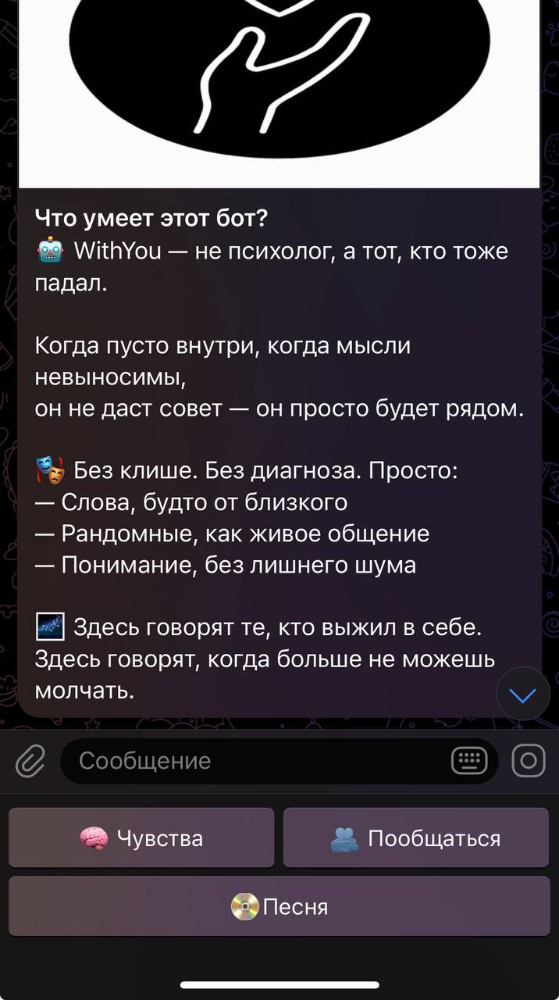
</p>

<h3>🧠 Меню чувств</h3>
<p align="left">
  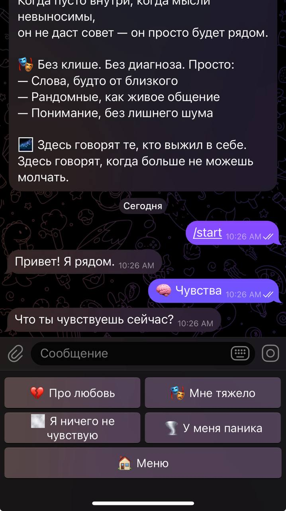
</p>

<h3>💬 Ответы на чувства</h3>
<p align="left">
  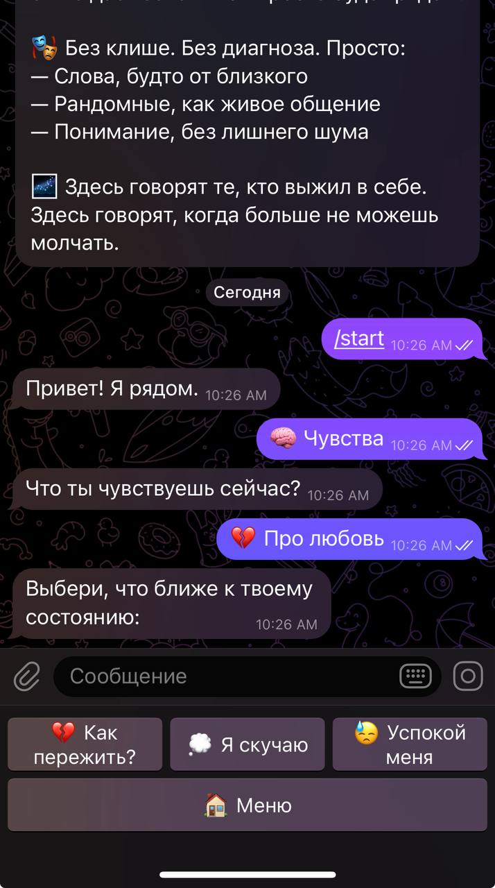
  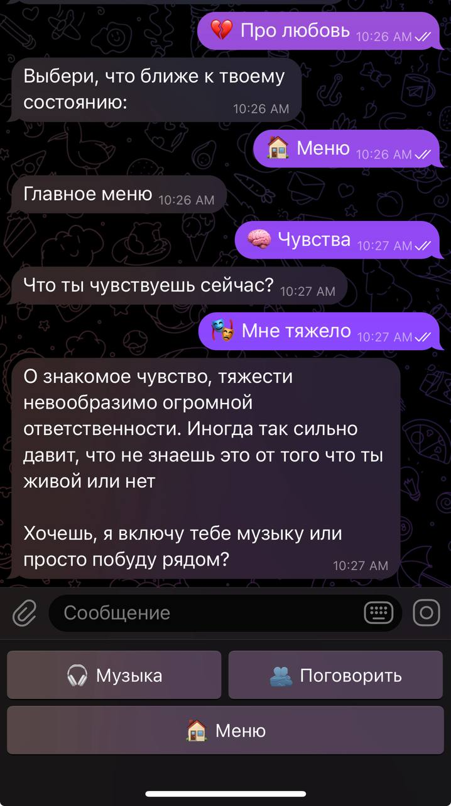
  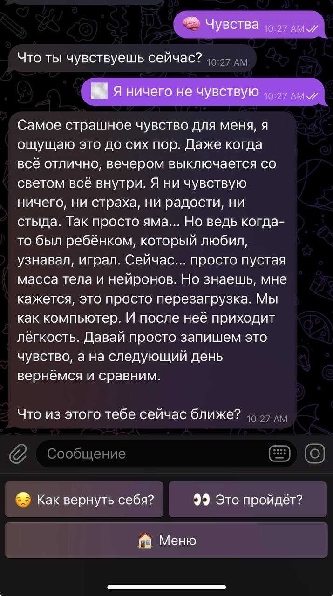
  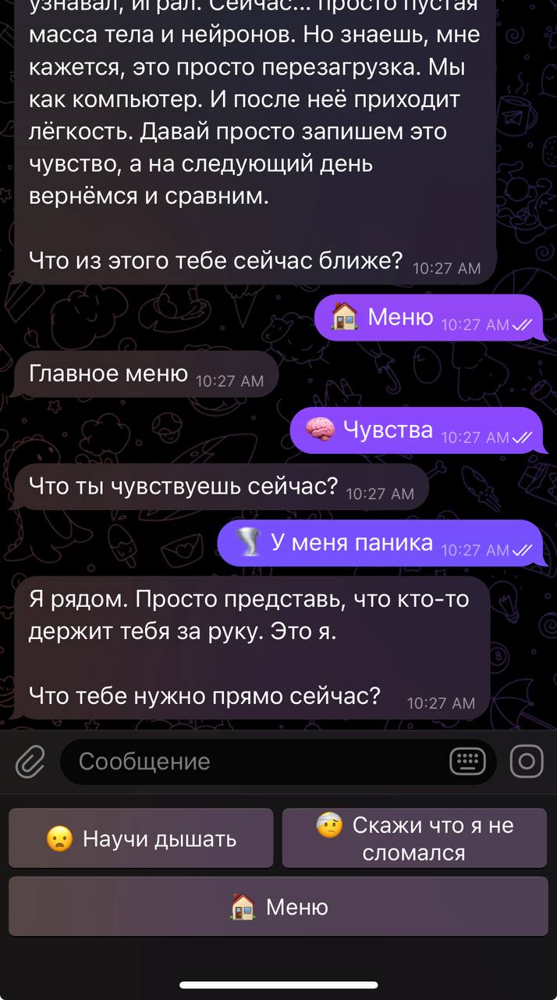
</p>

<h3>✉️ Письма незнакомцам</h3>
<p align="left">
  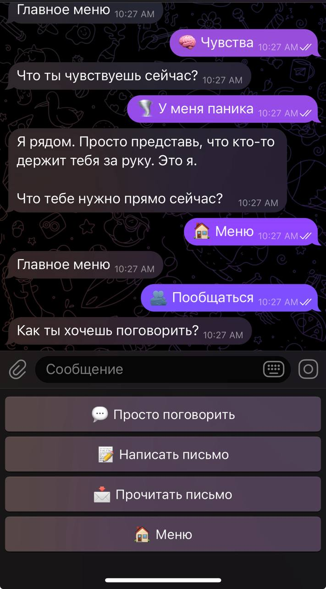
  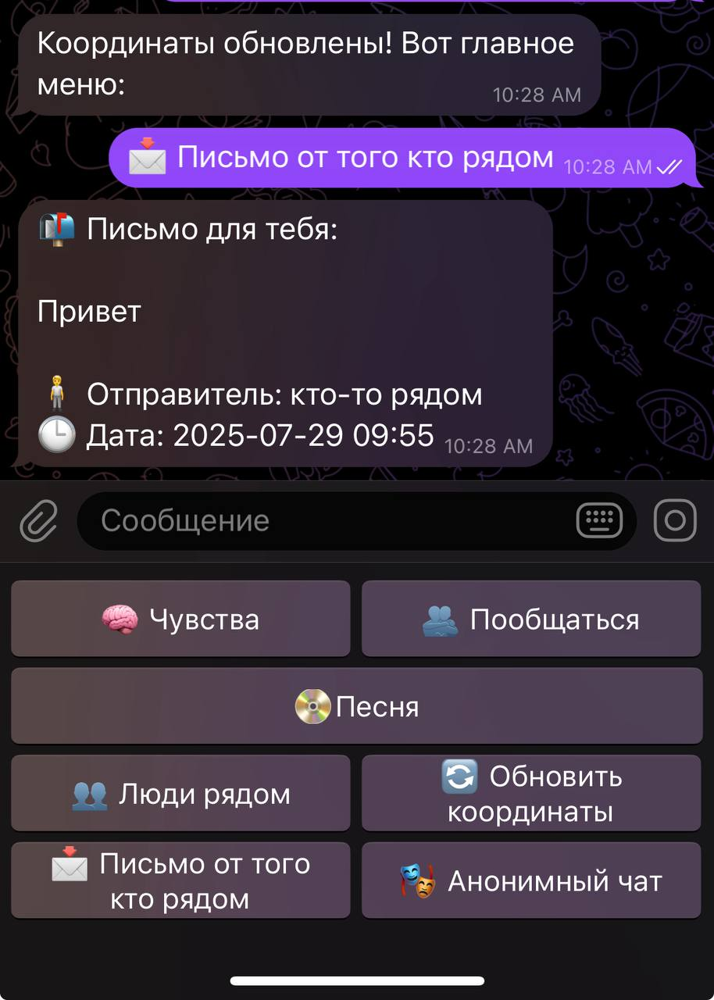
</p>

<h3>🎧 Музыка по состоянию</h3>
<p align="left">
  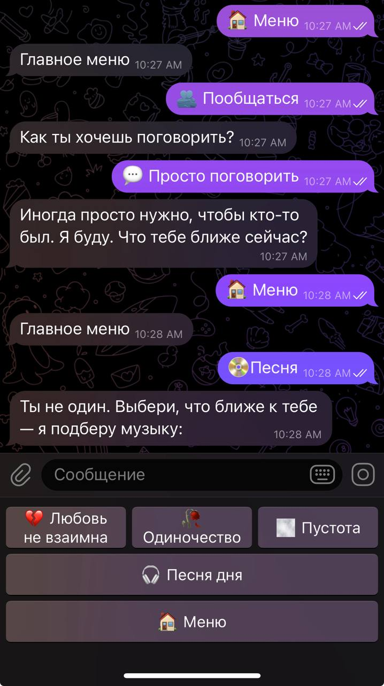
</p>

<h3>📍 Геолокация и люди рядом</h3>
<p align="left">
  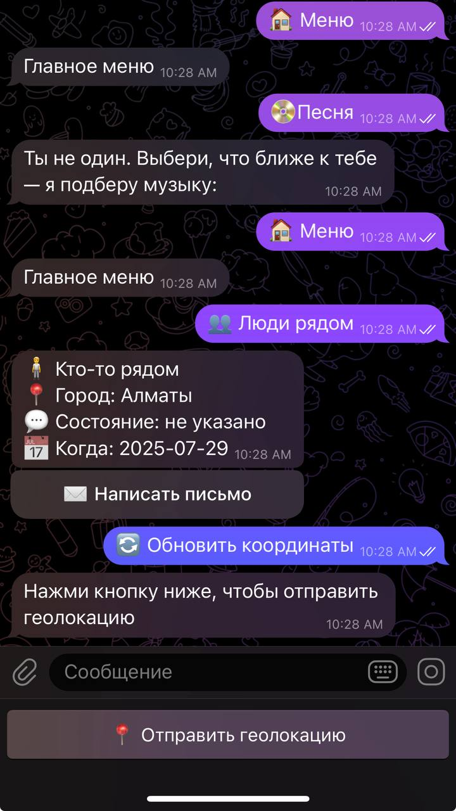
  
</p>

<h3>🎭 Анонимный чат</h3>
<p align="left">
  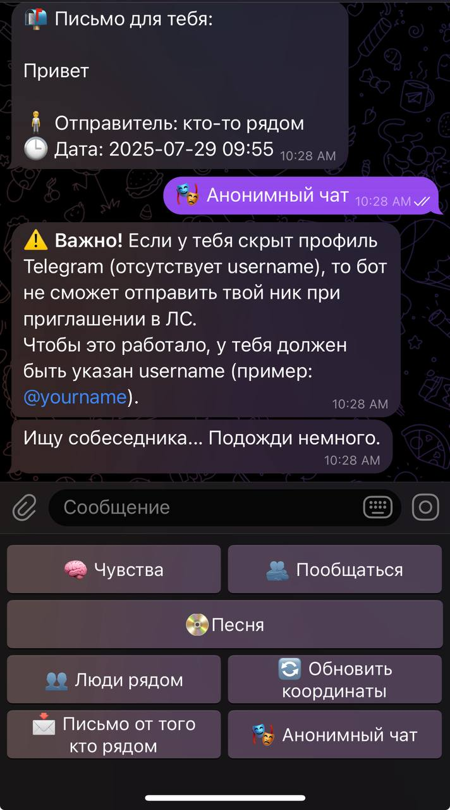
  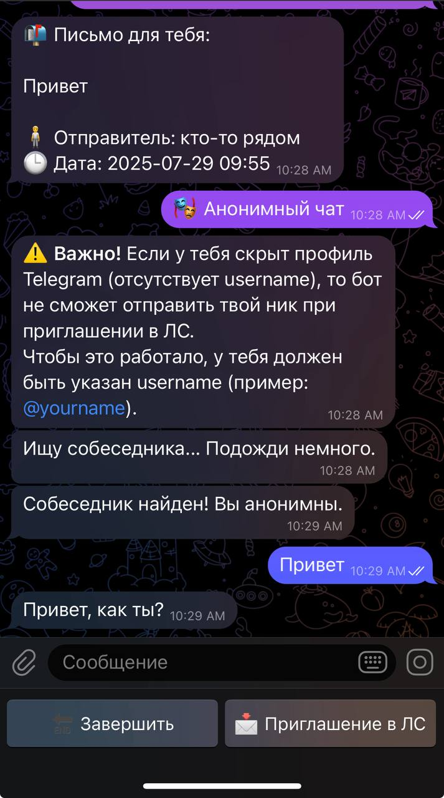
  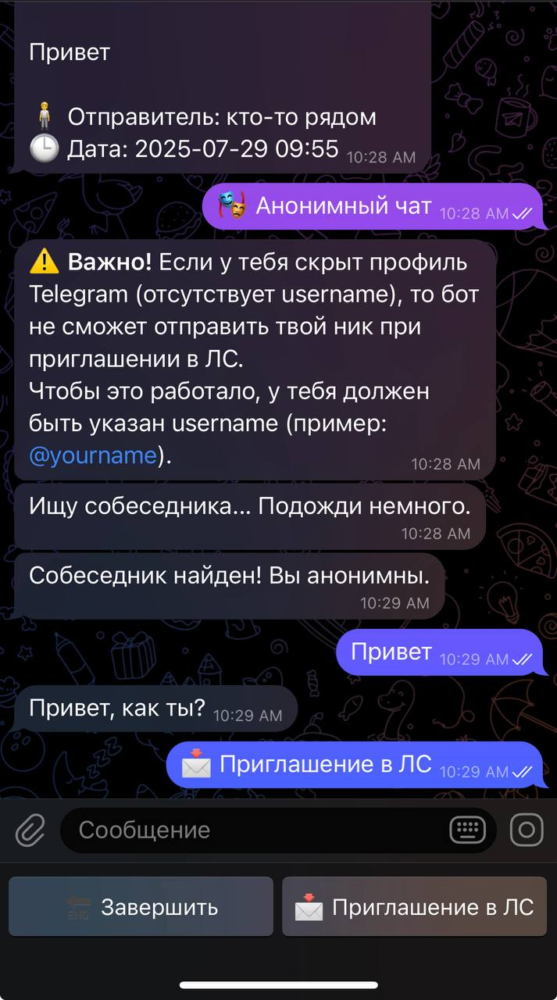
</p>

<p align="left">
  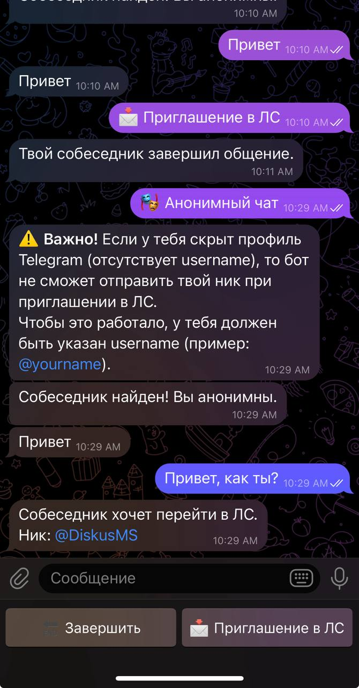
  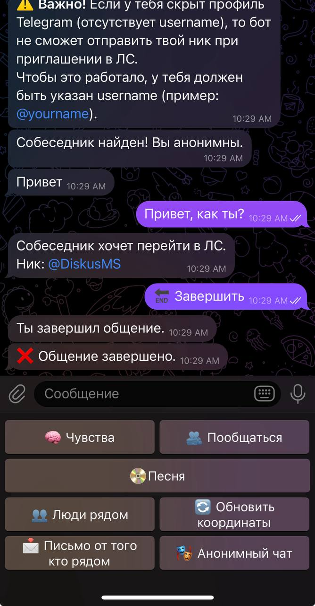
  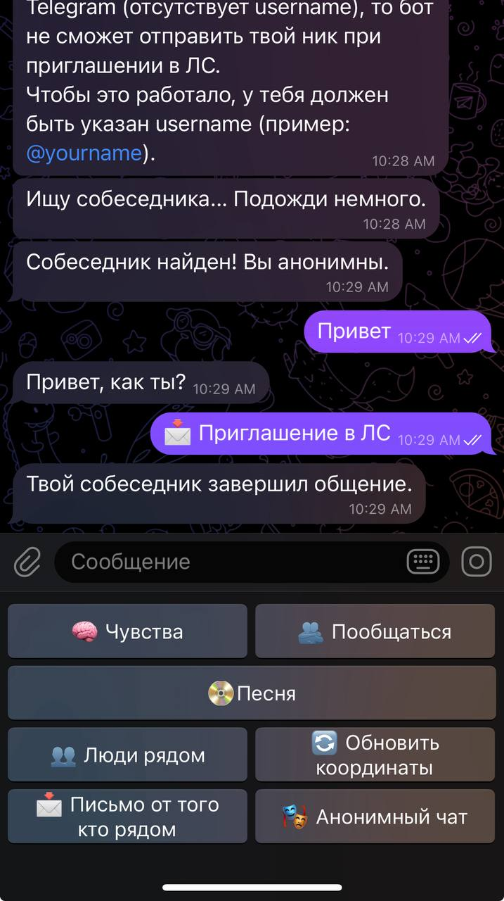
</p>


---

## 🛠 Технологии

| Технология | Использование |
|------------|----------------|
| `telebot` (PyTelegramBotAPI) | Основной фреймворк для Telegram-бота |
| `SQLite` | Хранение писем, геолокаций, активных чатов |
| `threading + scheduler` | Автозадачи, таймеры, удаление данных |
| `FSM (StateMachine)` | Сценарии с пошаговым вводом |
| Внешние API (по желанию) | Интеграция с музыкальными сервисами и трекерами |

---

## ❤️ От автора
Этот бот родился из желания помочь тем, кто чувствует пустоту.
Если ты один — ты не один.
Спасибо, что ты есть.

---

## 🚀 Как запустить локально

```bash
git clone https://github.com/Dente22/Withyou_bot1.git
cd Withyou_bot1
pip install -r requirements.txt
python main.py
